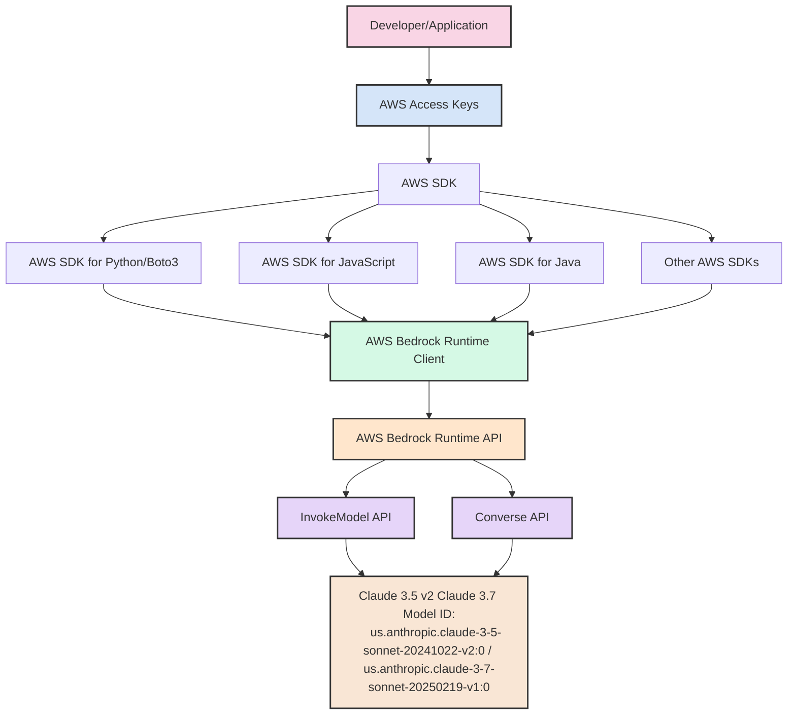

# AWS Bedrock 入门指南：面向不熟悉 AWS 的开发人员

## 简介

本指南旨在帮助不熟悉 AWS 的开发人员快速上手 Amazon Bedrock，特别是使用 Claude Sonnet 3.5 v2 和 Sonnet 3.7 模型。无需深入了解 AWS 的复杂架构，您也能轻松集成这些强大的 AI 模型到您的应用中。

## AWS Bedrock 是什么？

Amazon Bedrock 是 AWS 提供的一项完全托管的服务，让您能够通过简单的 API 调用访问来自 Anthropic、AI21 Labs、Cohere 等领先 AI 公司的基础模型。本指南将重点介绍 Anthropic 的 Claude Sonnet 系列模型。

## 访问流程概述


从上图可以看出，访问 AWS Bedrock 的基本流程为：

1. **获取访问凭证**：AWS 访问密钥（Access Key ID 和 Secret Access Key）
2. **使用 AWS SDK**：通过各种编程语言的 SDK 进行调用，例如Python需要boto3
3. **创建 Bedrock 客户端**：代码中使用 SDK 创建专门的 Bedrock Runtime 客户端
4. **调用 API**：使用 InvokeModel（原始接口，使用不同模型有参数的差异性，保持了原模型的使用风格）或 Converse（统一接口，统一了模型调用的传参）API
5. **获取模型响应**：接收并处理 Claude 模型返回的结果

## 第一步：获取 AWS 访问凭证

即使您不熟悉 AWS，这一步也很简单：

1. 向您的 AWS 管理员申请访问密钥（Access Key ID 和 Secret Access Key）
2. 这些密钥是您访问 AWS 服务的身份证明
3. **重要提示**：永远不要在代码中硬编码这些密钥，也不要将它们提交到版本控制系统

## 第二步：安装 AWS SDK

根据您使用的编程语言选择相应的 SDK：

### Python (Boto3)

```bash
pip install boto3
```

### JavaScript

```bash
npm install @aws-sdk/client-bedrock-runtime
```

### Java

```xml
<dependency>
    <groupId>software.amazon.awssdk</groupId>
    <artifactId>bedrock-runtime</artifactId>
    <version>[latest-version]</version>
</dependency>
```

## 第三步：配置 AWS 凭证

### 方法一：使用配置文件（推荐）

创建 `~/.aws/credentials` 文件：

```
[default]
aws_access_key_id = YOUR_ACCESS_KEY
aws_secret_access_key = YOUR_SECRET_KEY
region = us-west-2  # Bedrock 服务所在区域
```

### 方法二：使用环境变量

```bash
export AWS_ACCESS_KEY_ID=YOUR_ACCESS_KEY
export AWS_SECRET_ACCESS_KEY=YOUR_SECRET_KEY
export AWS_DEFAULT_REGION=us-west-2
```

## 第四步：创建 Bedrock 客户端并调用模型

### Python 示例

```python
import boto3
import json

# 创建 Bedrock Runtime 客户端
bedrock_runtime = boto3.client(
    service_name='bedrock-runtime',
    region_name='us-west-2'
)

# 单轮对话：使用 InvokeModel API
def invoke_claude(prompt):
    response = bedrock_runtime.invoke_model(
        modelId='us.anthropic.claude-3-5-sonnet-20241022-v2:0',  # Sonnet 3.5 v2
        # 或使用 'us.anthropic.claude-3-7-sonnet-20250219-v1:0' 表示 Sonnet 3.7
        body=json.dumps({
            "anthropic_version": "bedrock-2023-05-31",
            "max_tokens": 1000,
            "messages": [
                {"role": "user", "content": prompt}
            ]
        })
    )
    
    response_body = json.loads(response['body'].read())
    return response_body['content'][0]['text']

# 多轮对话：使用 Converse API
def converse_with_claude(messages):
    response = bedrock_runtime.converse(
        modelId='us.anthropic.claude-3-5-sonnet-20241022-v2:0',  # Sonnet 3.5 v2
        # 或使用 'us.anthropic.claude-3-7-sonnet-20250219-v1:0' 表示 Sonnet 3.7
        messages=messages
    )
    
    return response['output']['message']['content'][0]['text']

# 示例使用
result = invoke_claude("解释量子计算的基本原理")
print(result)

conversation = converse_with_claude([
    {"role": "user", "content": "你好，请介绍一下自己"},
    {"role": "assistant", "content": "我是 Claude，一个由 Anthropic 创建的 AI 助手。我可以帮助回答问题、撰写内容、分析数据等。"},
    {"role": "user", "content": "你能用 Python 写一个简单的网页爬虫吗？"}
])
print(conversation)
```

## InvokeModel 与 Converse API 的区别

invoke_model API:

- 是 Bedrock 的基础 API，用于直接调用任何支持的基础模型

- 需要按照每个模型提供商的特定格式构造请求

- 提供对原始模型接口的直接访问

converse API:

- 专门为对话应用场景设计的更高级别 API

- 提供了统一的接口，简化了对话应用的开发

- 标准化了不同模型的请求和响应格式


对比inovk_model与Anthropic原生参数体：

### 请求体参数比较

| 参数 | Anthropic 原生 API | Bedrock invoke_model | 差异说明 |
|------|-------------------|------------------------|---------|
| 消息格式 | messages: [{"role": "user", "content": "..."}] | messages: [{"role": "user", "content": "..."}] | 完全相同 |
| 最大令牌数 | max_tokens: 1000 | max_tokens: 1000 | 完全相同 |
| 温度 | temperature: 0.7 | temperature: 0.7 | 完全相同 |
| 采样概率 | top_p: 0.9 | top_p: 0.9 | 完全相同 |
| 停止序列 | stop_sequences: ["Human:"] | stop_sequences: ["Human:"] | 完全相同 |
| 系统提示 | system: "You are a helpful assistant" | system: "You are a helpful assistant" | 完全相同 |
| 流式输出 | stream: true | 不在请求体中，使用单独的 API | Bedrock 使用不同的 API 进行流式输出 |
| 模型指定 | model: "claude-3-5-sonnet-20241022" | 不在请求体中，而是通过 modelId 参数 | Bedrock 将模型指定移到了请求体外 |
| API 版本 | 不在请求体中，而是通过 anthropic-version 请求头 | anthropic_version: "bedrock-2023-05-31" | Bedrock 将版本移到了请求体内 |
| 元数据 | metadata: {...} | 不支持 | Anthropic 特有 |


## 常见问题解答

### 1. 我需要了解 AWS 的其他服务吗？
不需要。只要有正确的访问凭证和基本的 SDK 使用知识，您就可以开始使用 Bedrock。

### 2. 如何处理错误和异常？
AWS SDK 提供了标准的错误处理机制。常见错误包括认证失败、配额限制和网络问题。建议实现适当的重试逻辑和错误处理。

### 3. 有使用限制吗？
是的，AWS Bedrock 有 API 调用频率和令牌使用量的限制。这些限制可以通过联系 AWS 支持来增加。


## 结论

即使您不熟悉 AWS 生态系统，通过本指南，您也可以轻松地将 Claude Sonnet 模型集成到您的应用中。关键步骤是获取正确的访问凭证，安装适当的 SDK，然后使用 InvokeModel 或 Converse API 与模型进行交互。

随着您对服务的熟悉，可以探索更高级的功能，如模型参数调整、批量处理和自定义提示工程，以充分发挥 Claude 模型的潜力。

## 其他资源

- [AWS Bedrock 官方文档](https://docs.aws.amazon.com/bedrock/)
- [Anthropic Claude 文档](https://docs.anthropic.com/claude/docs)
- [AWS 实例程序]([https://aws.amazon.com/tools/](https://docs.aws.amazon.com/bedrock/latest/userguide/service_code_examples_bedrock-runtime_anthropic_claude.html))

祝您使用愉快！
